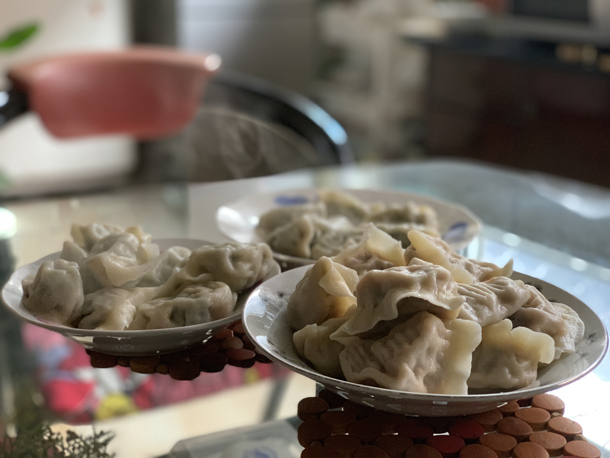
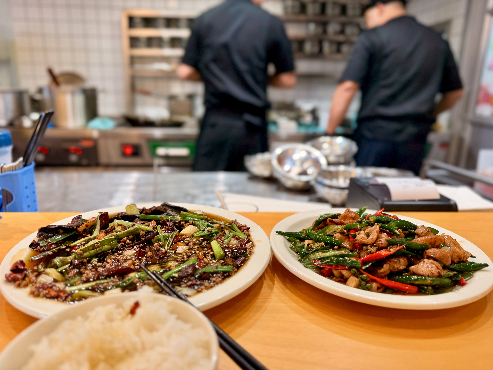
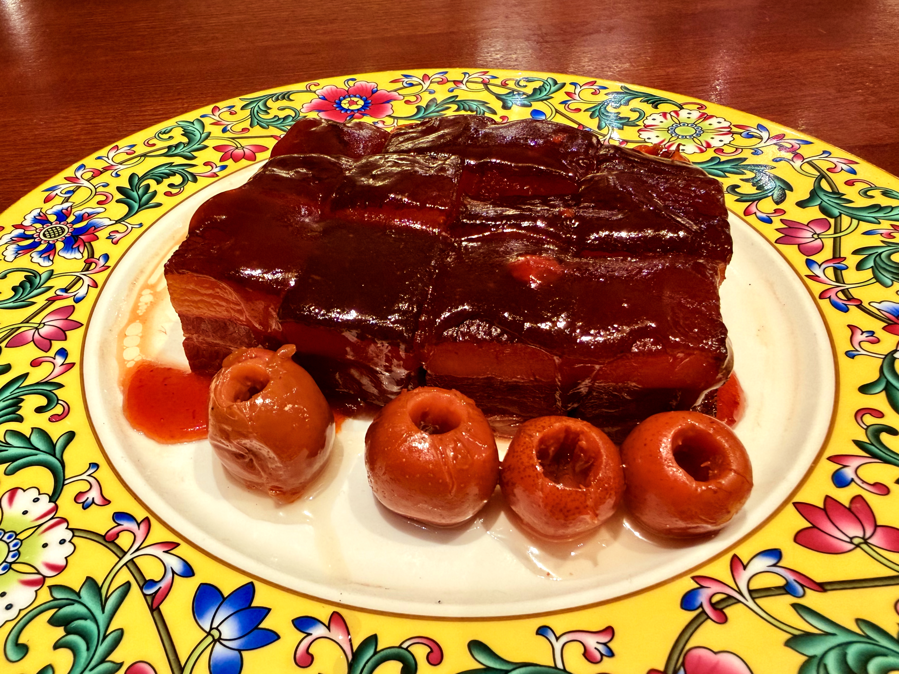
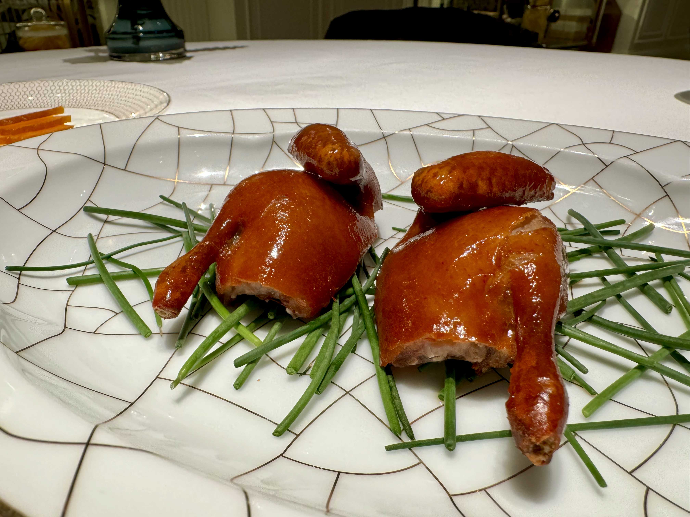
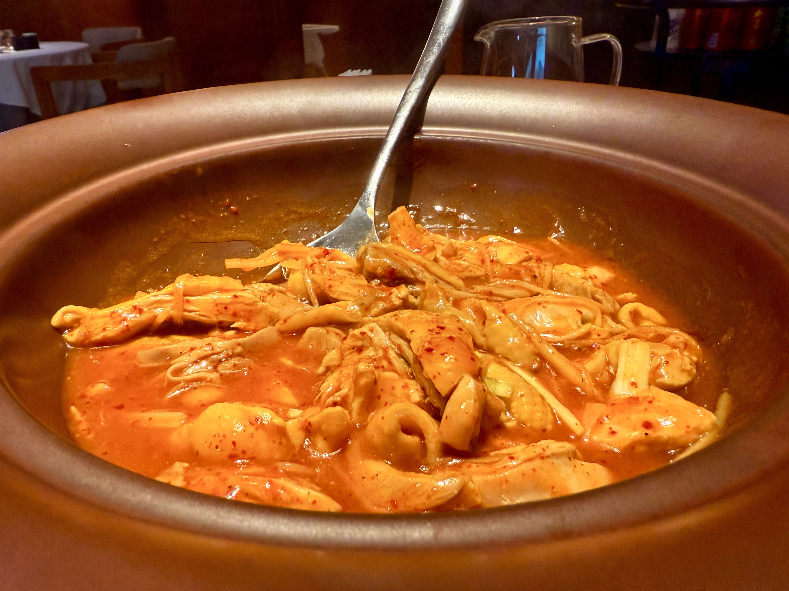

A list of food memories back in Beijing. Always updating...

蒋姨家的饺子是全世界最好吃的东西！

京华楼的油爆双脆是中餐集刀工，火候，调味于一体的典范。

俏东北的东北名菜锅包肉。

德富来炒菜店的火爆鳝鱼，双椒肥肠, 板前川菜，镬气十足。

京华楼姑苏“四大名肉”之糟汁肉：选用上好的五花肉蒸至定型，用酒糟泥包裹腌制两天，再经过油炸、糟汁炖、冷却，最后上桌前蒸熟浇汁，糟香浓郁、软糯鲜香。

潮上潮的乳鸽，外皮酥脆，肉质爆汁。

丰泽园的葱烧海参，葱香浓郁，海参软糯入味。

湘上湘的东安鸡，味型独特，醋酸与姜辣交织，回味悠长。
