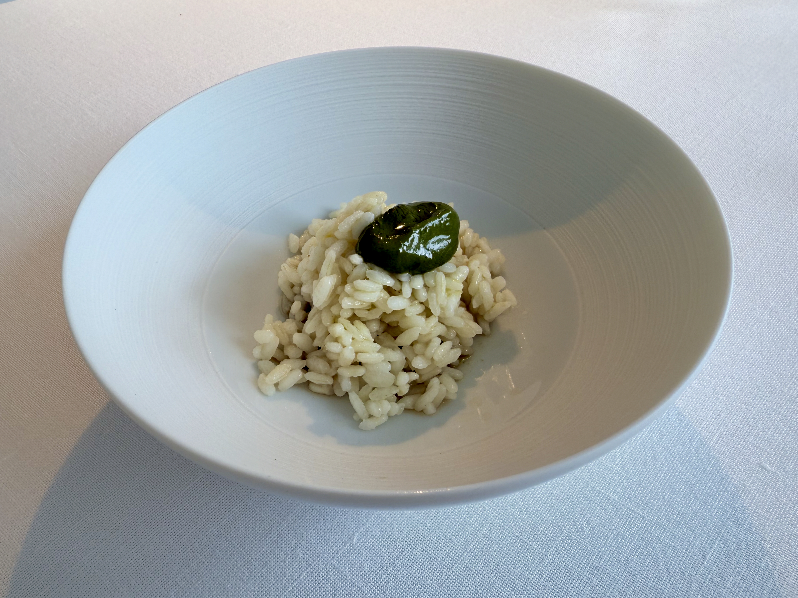
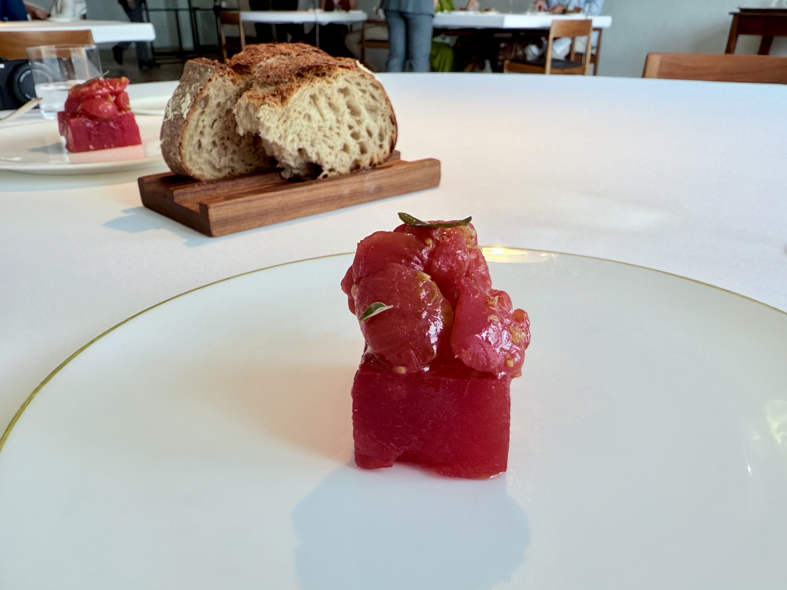
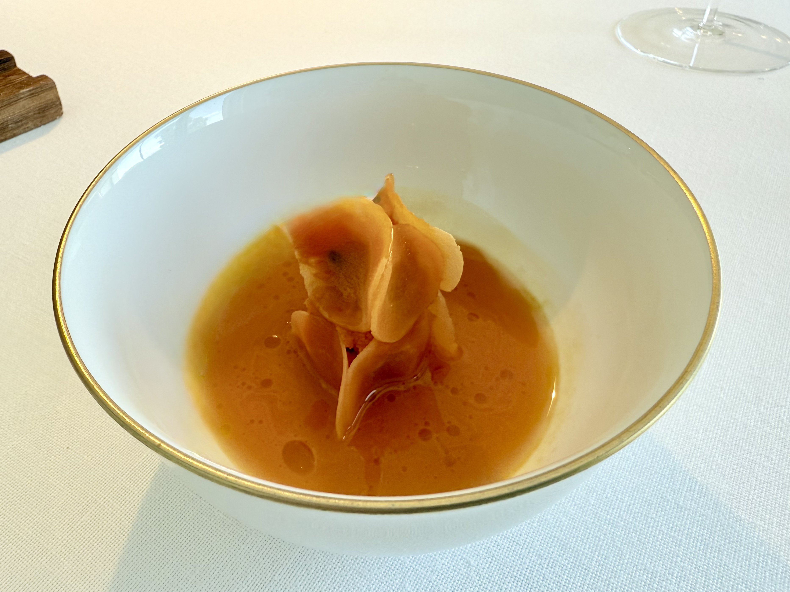
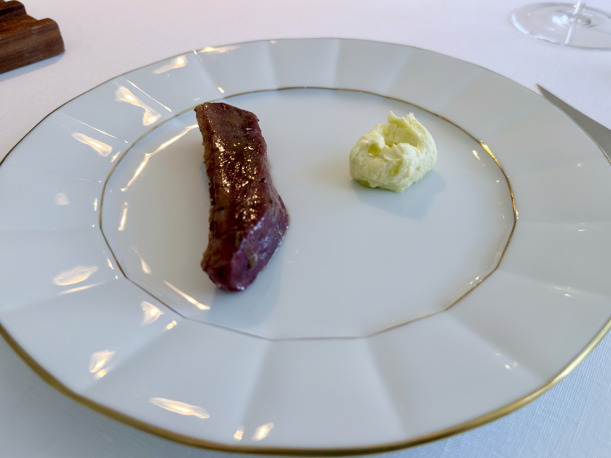
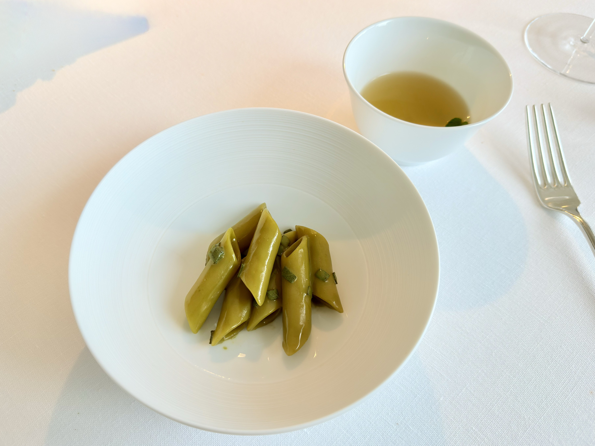
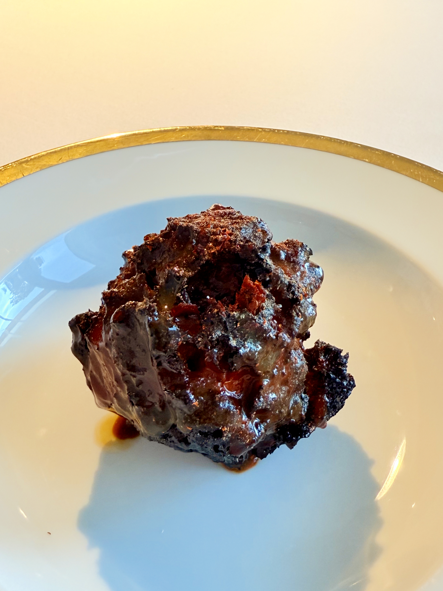
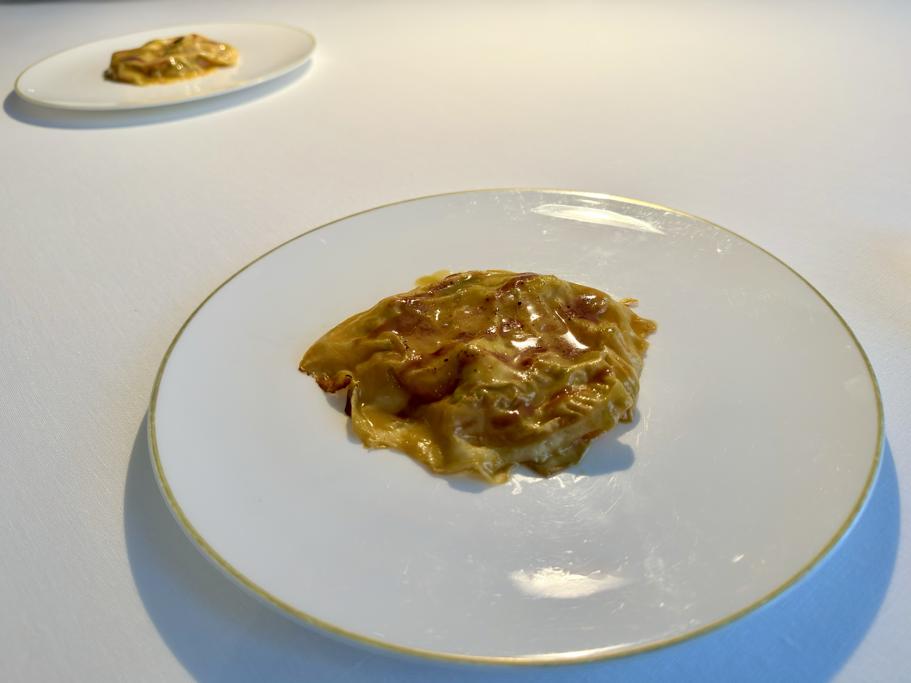
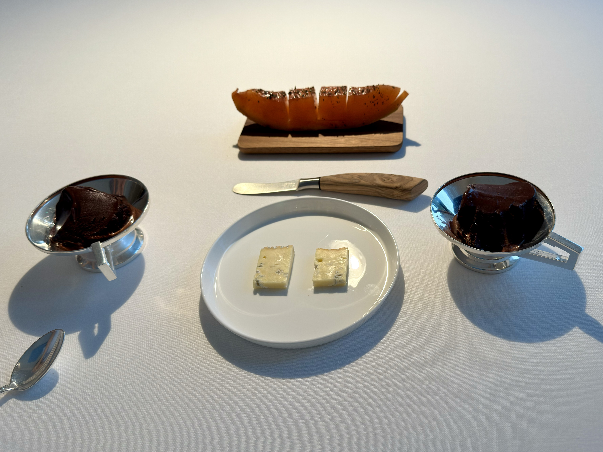

The natural flavour from ingredients are generally more complex and deep than what seasonings can provide. Great chefs bring out the best in each ingredient, but Chef Romito takes it to another level. He uses all kinds of techniques to showcase multiple flavors from a single ingredient in each dish. Over ~80% of dishes have some aspects that I've never tasted before, and ~80% is pretty easy for me to enjoy.

I also want to give a big shout out to the manager, Cristiana Romito, who is the sister of Chef Romito. Being the only non-Italian-speaking table at that lunch service, I can see that the chef tried to avoid talking to us because he only speaks a little English. The manager (or more importantly, as the chef’s sister), ‘solicited’ him to chat with us and graciously helped us understand each other. We had a wonderful conversation about his unique cooking techniques and his overall culinary philosophy. It was truly a revelation for me to realize how hospitality can transform a dining experience into something truly memorable.

I think all the dishes are well-designed and well-executed. Any dishes lower than 8/10 are just because I'm not used to that flavour profile. Sometimes great flavours are hidden behind unpleasant smells/tastes, like cheese and century-age eggs. You just need to learn how to appreciate them.

This resatrant has a heavy focus on vegetables, but it's not bacause of veganism or vegetarianism. The chef is just trying to showcase the complexity of ingredients, and vegetables are more complex than meat. I think this is the way for a more sustainable future, and I hope more chefs will follow this path instead of forbidding meat.

**Mixed wild greens with tomato, extra virgin olive oil and spelt** 8/10 The greens are from the restaurant's garden, with some umami elements in the dressing.

**Ostrica e cicoria** 7/10 It's a fresh taste of bitterness and brininess.

**Rice, basil pesto, anise and lemon** 7/10 They emphasised that it's not a risotto. The lemon and pesto are balanced with the sweetness from anise, but the taste of anise (other than sweetness) is a bit too strong for me.

**Bread** 9/10A simple sourdough bread that is meant to be enjoyed alone. The chef and manager's parents used to run a bakery when they were young.

**Tomato and watermelon** 10/10 The watermelon was dehydrated, then rehydrated to be infused with tomato flavours. The texture of watermelon is really unique.

**Codfish and fig leaf** 10/10 The fish is cooked to perfection, with the unique taste of fig leaf made into a smooth sesame sause-like consistency.

**Warm Swiss chard salad** 10/10 The swiss chard is cooked in different ways like fried, blanched, pickled, etc., then mixed together to show how a simple vegetable can taste so diverse.

**Carrot** 10/10 This is my favourite dish, because the fermented carrot juice at the bottom is so good. The sourness from fermentation and sweetness from fresh carrots are balanced just at the right point.

**Duck and juniper** 9/10 The duck is first roasted in oven as a whole bird, then ice-bathed to stop cooking (first time I've heard it used on roasted meat). Then the breast is filleted and finished on a grill. I do want to give this technique a try back home.

**Penne and sage** 8/10 The penne is al dente with a sage sauce full of bitterness. The waiter told us we'll be able to appreciate the taste of bitterness after several bites. I feel like I tasted something in the last one or two pasta, but still the strong bitterness won't go away. The soup is also made with sage, but less bitter and more refreshing. The small leaf in the soup is meant to be eaten at the end, and it's a sweet leaf that the taste lasted for hours in my mouth.

**Red pepper and bread** 9/10 It's a fried bread dough soaked with red pepper sauce/juice. The texture is almost steak-like: a crust on the outside with a soft inside. Despite the lack of meat dishes for the whole meal, I still feel fulfilled at the end.

**Apricot, rosemary and rhubarb** 6/10 Over half of the main desert I had in Europe this summer is made with apricot, so this one didn't stand out. The apricot itself is not flavorful compared to others, and I personally do not like rhubarb.

**Petit four** 8/10 A melon with spice, like the Mexican fruit cut, some cheese, and a chocolate sorbet (a really good one).

